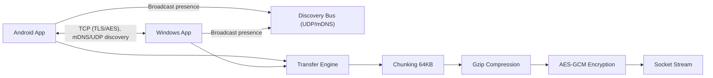

# Sendix Architecture

## System Overview

## Components

- Device Discovery
Uses UDP broadcast on the local WiFi network to announce presence and listen for peers. The discovery payload includes device name, IP, port, and capabilities. The design keeps a TTL cache and updates the UI as devices appear or disappear.

- Connection Manager
Maintains a TCP server for incoming transfers and establishes outbound TCP connections for sending. Each transfer is isolated to a single socket to allow concurrent transfers.

- Transfer Engine
Implements a framed protocol over TCP with a handshake, file manifests, chunk streaming, and integrity checks. Files are split into 64KB chunks, compressed, encrypted, and streamed. The receiver reverses the pipeline and verifies SHA-256 checksums.

- File Manager
Handles file and folder selection, builds transfer manifests with relative paths, and maps incoming files to a per-device download directory.

- UI Layer
Flutter UI with Send and Receive screens. Send shows nearby devices and supports file or folder selection. Receive shows incoming transfer requests, approval dialogs, and progress.

## Protocol Summary

- Transport: TCP
- Framing: 1-byte type + 4-byte length + payload
- Handshake: exchange device info and ephemeral public keys
- Encryption: AES-GCM with session keys derived from X25519 shared secret
- Compression: Gzip per chunk
- Integrity: SHA-256 per file

## Security Model

- Device approval before accepting a transfer
- Ephemeral key exchange per connection
- Authenticated encryption on every chunk
- Checksum verification on file completion

## Data Flow

1. Sender discovers device via UDP broadcast.
2. Sender opens TCP connection and sends `HELLO` with manifest and public key.
3. Receiver shows approval prompt, replies `ACCEPT` with its public key.
4. Sender streams files as `FILE_START` → `CHUNK`* → `FILE_END`.
5. Receiver decrypts, decompresses, writes to disk, and verifies checksum.

